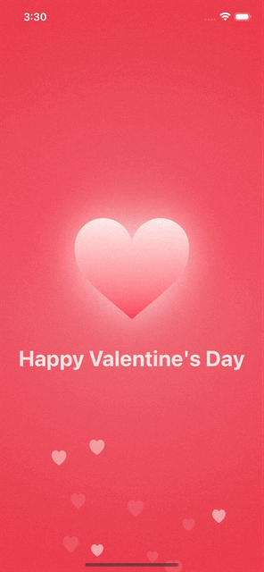

# ❤️ Valentine’s Day Animated Intro (SwiftUI)

An advanced SwiftUI animation project demonstrating custom rendering, particle systems, animation orchestration, and performance optimization in a production-ready architecture.

Built entirely with **native SwiftUI** — no third-party libraries.

---

## 🎯 Project Objective

To showcase advanced SwiftUI animation capabilities, state-driven rendering, and GPU-optimized compositing while maintaining smooth 60fps performance.

This project highlights clean architecture, modular components, and animation precision.

---

## 🚀 Technical Highlights

### 💓 Custom Animatable Shape
- Built a dynamic `HeartShape` using `Shape`
- Leveraged `animatableData` for smooth morph transitions
- Implemented organic breathing/pulse timing

### 💥 Interactive Particle Explosion System
- Randomized vector-based motion (angle + velocity)
- Automatic lifecycle cleanup
- Performance-safe state management

### 💕 Floating Background Particle Layer
- Lightweight reusable particle component
- Continuous animation using implicit animation loops
- No timers, no frame drops

### 🌅 Advanced Compositing & Visual Effects
- Layered `RadialGradient`
- `.blendMode(.screen)` for glow realism
- `.compositingGroup()` + `.drawingGroup()` for GPU acceleration

### 🎬 Animation Orchestration
- Coordinated implicit & explicit animations
- Carefully tuned easing curves
- Staggered entrance sequencing

---

## 🏗 Architecture

- Modular components  
- Clean state management  
- Reusable animation primitives  

---

## 📊 Performance

- Optimized for 60fps rendering  
- No third-party dependencies  
- Minimal state mutation  
- Efficient particle cleanup  
- GPU-backed rendering pipeline  

Tested on modern iOS devices and simulators.

---

## 🛠 Tech Stack

- Swift 5  
- SwiftUI  
- Xcode 15+  
- iOS 16+  

---

## 💡 What This Demonstrates

- Advanced SwiftUI animation control  
- Custom vector drawing  
- Particle system design  
- UI performance optimization  
- Clean, scalable UI architecture  

---

## 🔗 Repository

👉 [https://github.com/tjana17/HappyValentinesDay](https://github.com/tjana17/HappyValentinesDay)

---

## 👨‍💻 About Me

iOS Developer focused on:
- High-performance UI
- Animation systems
- Clean architecture
- Production-ready SwiftUI apps

Open to collaboration and new opportunities.

---

## Screens

